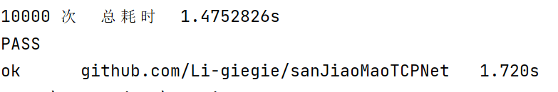

# 一个简基于Golang protobuf 的简单 并发TCP 框架

## 支持客户端请求服务端 就像HTTP那样 基于接口的形式

## 也可以把公网的请求转发到内网客户端上面自己写处理程序

## 支持把请求转发到与服务端建立连接的其他客户端上

### 例如你拥有一台公网服务器可以把服务端部署在你的公网服务器中，内网在启动两个客户端就可以通信了。

### 一、基本的功能

    1.支持服务端转发请求
    
    2.支持客户端并行请求
    
    3.支持服务端接口处理请求 
    
    4.支持建立连接前的认证

### 二、核心功能

    1.client -> server 客户端发起请求服务端处理
    
    2.client1 -> server -> client2  客户端1 发给服务端 服务端转发到 客户端2

### 三、测试数据

    1.测试环境  Windows 12 笔记本电脑 显卡 1650 内存 13.9

    2.客户端请求服务端 本地环境 1024Byte 10000次请求 耗时3.431s

    3.客户端请求服务器转发 本地环境 1024Byte 10000次请求 耗时1.1714s

